# Module 10

**Mục lục**
- [Module 10](#module-10)
  - [Xem danh sách bác sĩ và chi tiết một bác sĩ](#xem-danh-sách-bác-sĩ-và-chi-tiết-một-bác-sĩ)
    - [10\_XemDanhSachBacSi\_001](#10_xemdanhsachbacsi_001)
    - [10\_XemDanhSachBacSi\_002](#10_xemdanhsachbacsi_002)
    - [10\_XemDanhSachBacSi\_003](#10_xemdanhsachbacsi_003)
    - [10\_XemDanhSachBacSi\_004](#10_xemdanhsachbacsi_004)
    - [10\_XemDanhSachBacSi\_007](#10_xemdanhsachbacsi_007)
    - [10\_XemDanhSachBacSi\_008](#10_xemdanhsachbacsi_008)
    - [10\_XemDanhSachBacSi\_010](#10_xemdanhsachbacsi_010)
  - [Thêm, sửa, xóa bác sĩ](#thêm-sửa-xóa-bác-sĩ)
    - [10\_ThemSuaXoaBacSi\_001](#10_themsuaxoabacsi_001)
    - [10\_ThemSuaXoaBacSi\_002](#10_themsuaxoabacsi_002)
    - [10\_ThemSuaXoaBacSi\_003](#10_themsuaxoabacsi_003)
    - [10\_ThemSuaXoaBacSi\_004](#10_themsuaxoabacsi_004)
    - [10\_ThemSuaXoaBacSi\_005](#10_themsuaxoabacsi_005)
    - [10\_ThemSuaXoaBacSi\_006](#10_themsuaxoabacsi_006)
    - [10\_ThemSuaXoaBacSi\_007](#10_themsuaxoabacsi_007)
    - [10\_ThemSuaXoaBacSi\_008](#10_themsuaxoabacsi_008)
    - [10\_ThemSuaXoaBacSi\_009](#10_themsuaxoabacsi_009)
    - [10\_ThemSuaXoaBacSi\_011](#10_themsuaxoabacsi_011)

## Xem danh sách bác sĩ và chi tiết một bác sĩ

- Thanh tìm kiếm:
  - Tìm kiếm bác sĩ theo tên, số điện thoại, email
- Dropdown "Sắp xếp theo chiều":
  - Mặc định
  - Từ trên xuống dưới
  - Từ dưới lên trên
- Dropdown "Sắp xếp theo giá trị":
  - Mặc định (để trống)
  - Tên bác sĩ
  - Vai trò
- Dropdown "Trạng thái":
  - Mặc định (để trống)
  - Đang hoạt động
  - Vô hiệu hóa
- Dropdown "Sắp xếp theo chuyên khoa":
  - Mặc định (để trống)
  - Hỗ trợ viên
  - Nhi khoa
  - Châm cứu
  - Sức khỏe tâm lý
  - Nhãn khoa
  - Tim mạch
  - Tiêu hóa
  - Nội tổng hợp
- Dropdown "Sắp xếp theo phòng khám":
  - Mặc định (để trống)
  - Phòng 104 Khu A, tầng 1
  - Phòng 102 Khu A, tầng 1
  - Phòng 246 Khu C, Tầng 4
  - Phòng 103 Khu A, tầng 1
- Số lượng kết quả trả về
  - Mặc định
  - 5, 10, 15, 20, 25, 30.

| TC  | Trường được kiểm tra | Giá trị kiểm tra        | Trường còn lại | Kết quả mong đợi                         | Testing Purpose                        |
| --- | -------------------- | ----------------------- | -------------- | ---------------------------------------- | -------------------------------------- |
| 1   | Tìm kiếm             | Tên bác sĩ              | Mặc định       | Hiển thị đúng bác sĩ khớp tên            | Kiểm tra hoạt động tìm kiếm theo tên   |
| 2   | Tìm kiếm             | Số điện thoại           | Mặc định       | Hiển thị đúng bác sĩ khớp số điện thoại  | Kiểm tra hoạt động tìm kiếm theo SĐT   |
| 3   | Tìm kiếm             | Email                   | Mặc định       | Hiển thị đúng bác sĩ khớp email          | Kiểm tra hoạt động tìm kiếm theo Email |
| 4   | Sắp xếp theo chiều   | Từ trên xuống           | Mặc định       | Danh sách sắp xếp từ trên xuống          | Kiểm tra chiều sắp xếp tăng dần        |
| 5   | Sắp xếp theo chiều   | Từ dưới lên             | Mặc định       | Danh sách sắp xếp từ dưới lên            | Kiểm tra chiều sắp xếp giảm dần        |
| 6   | Sắp xếp theo giá trị | Tên bác sĩ              | Mặc định       | Danh sách sắp xếp theo tên               | Kiểm tra sắp xếp theo tên              |
| 7   | Sắp xếp theo giá trị | Vai trò                 | Mặc định       | Danh sách sắp xếp theo vai trò           | Kiểm tra sắp xếp theo vai trò          |
| 8   | Trạng thái           | Đang hoạt động          | Mặc định       | Chỉ hiển thị bác sĩ đang hoạt động       | Kiểm tra lọc trạng thái hoạt động      |
| 9   | Trạng thái           | Vô hiệu hóa             | Mặc định       | Chỉ hiển thị bác sĩ bị vô hiệu hóa       | Kiểm tra lọc trạng thái vô hiệu hóa    |
| 10  | Chuyên khoa          | Nhãn khoa               | Mặc định       | Chỉ hiển thị bác sĩ thuộc chuyên khoa đó | Kiểm tra lọc chuyên khoa               |
| 11  | Chuyên khoa          | Tâm lý                  | Mặc định       | Chỉ hiển thị bác sĩ thuộc chuyên khoa đó | Kiểm tra lọc chuyên khoa               |
| 12  | Phòng khám           | Phòng 104 Khu A, tầng 1 | Mặc định       | Chỉ hiển thị bác sĩ thuộc phòng khám đó  | Kiểm tra lọc phòng khám                |
| 13  | Số lượng kết quả     | 5                       | Mặc định       | Chỉ hiển thị 5 kết quả đầu tiên          | Kiểm tra phân trang / giới hạn dữ liệu |

### 10_XemDanhSachBacSi_001

Issue 1, 16, 17, 21, 25, 36, 45
Trên thanh điều hướng có thể truy cập vào trang quản lý bác sĩ không thuộc quyền của Bác sĩ. Tooltip không hiển thị khi để chuột vào, không có nút mặc định.
Nút ""Làm mới"" không có tác dụng làm mới thông tin mà chỉ set giá trị tìm kiếm về mặc định và thực hiện tìm kiếm nó.
Khi thu nhỏ chiều rộng quá mức không có thanh cuộn chiều rộng.
Cụm từ ""mức giá"" không phù hợp để đại diện cho lương của bác sĩ.
Các giá trị để sắp xếp nhưng lại không thể hiện trên danh sách bào gồm: ID, Mức giá, email, thời gian tạo, thời gian cập nhật lần cuối sẽ không test vì không thể hiện được. 
Các giá trị chọn của dropdown không có mặc định hoặc tất cả để chọn lại sau khi đã lọc mà chỉ có thể thông qua nút làm mới để xóa hết.
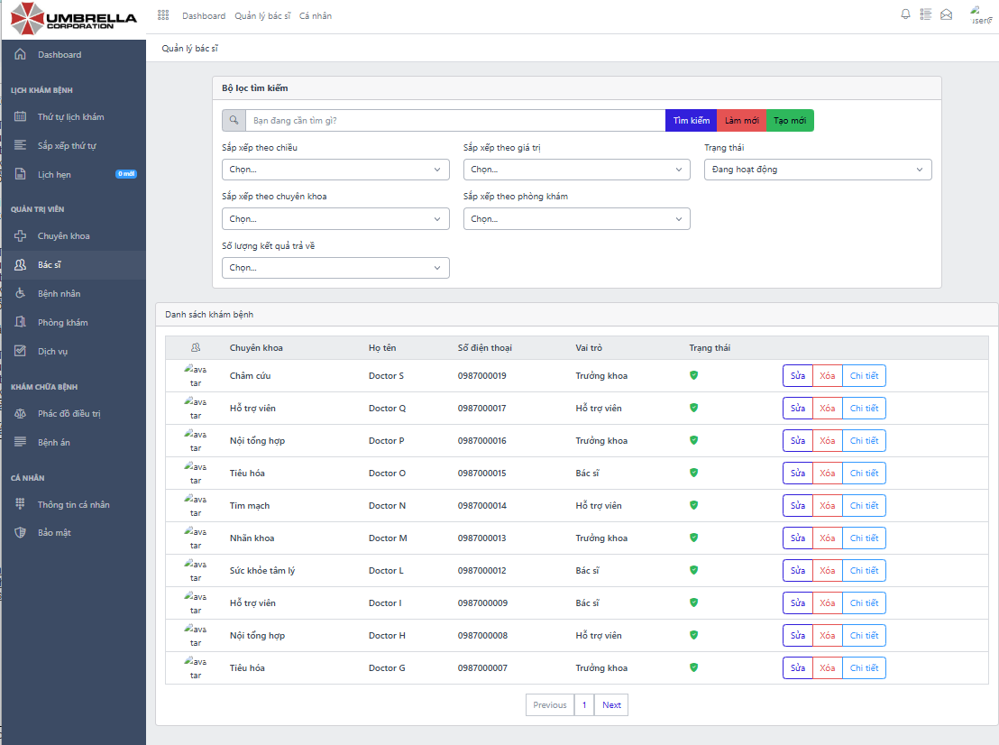

### 10_XemDanhSachBacSi_002

Không tìm kiếm đúng kết quả mong muốn.
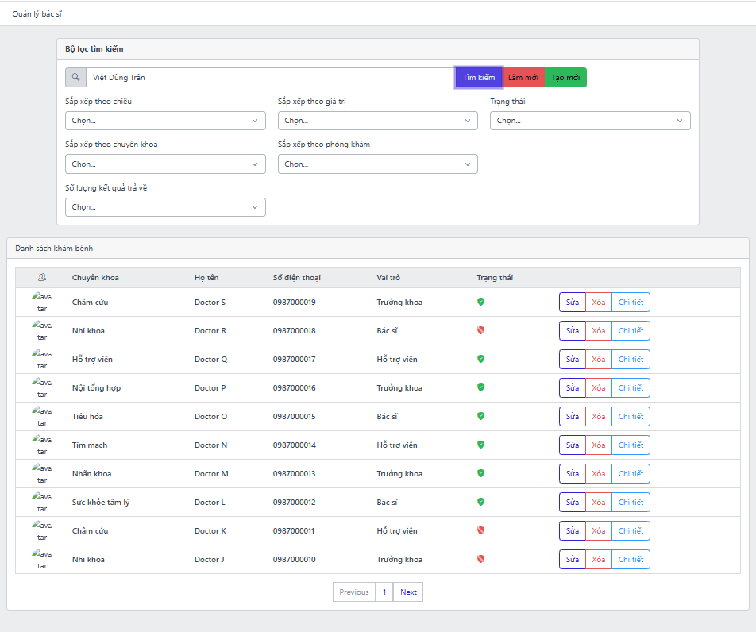

### 10_XemDanhSachBacSi_003

Không tìm kiếm đúng kết quả mong muốn.
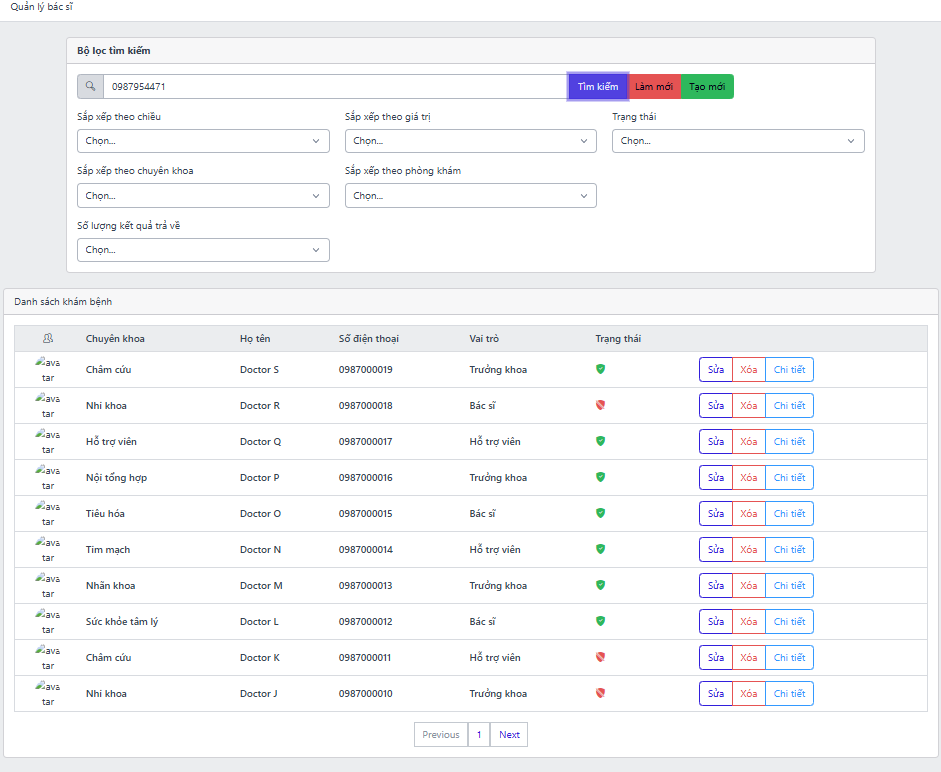

### 10_XemDanhSachBacSi_004

Không tìm kiếm đúng kết quả mong muốn.
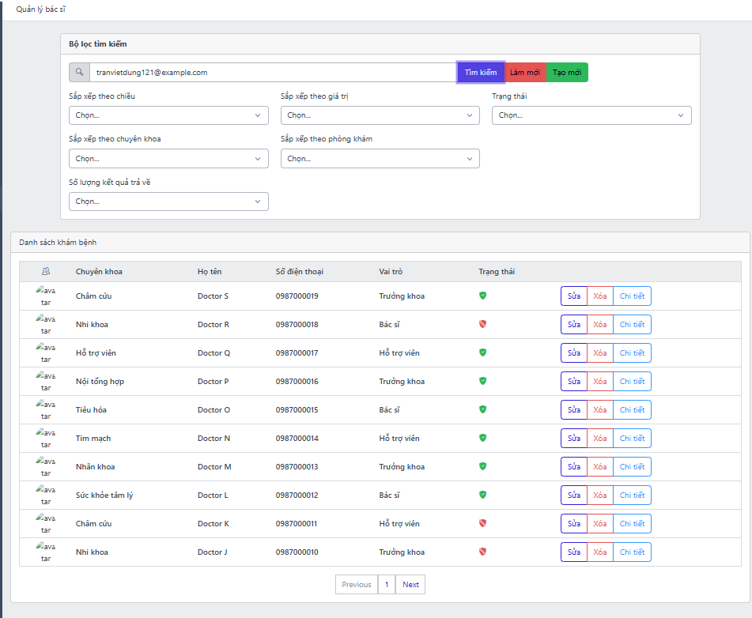

### 10_XemDanhSachBacSi_007

Sắp xếp không hoạt động chính xác.
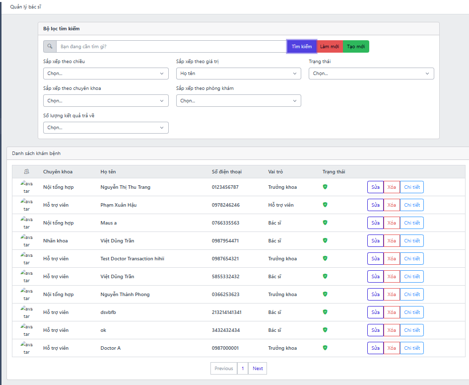

### 10_XemDanhSachBacSi_008

Sắp xếp không hoạt động chính xác.
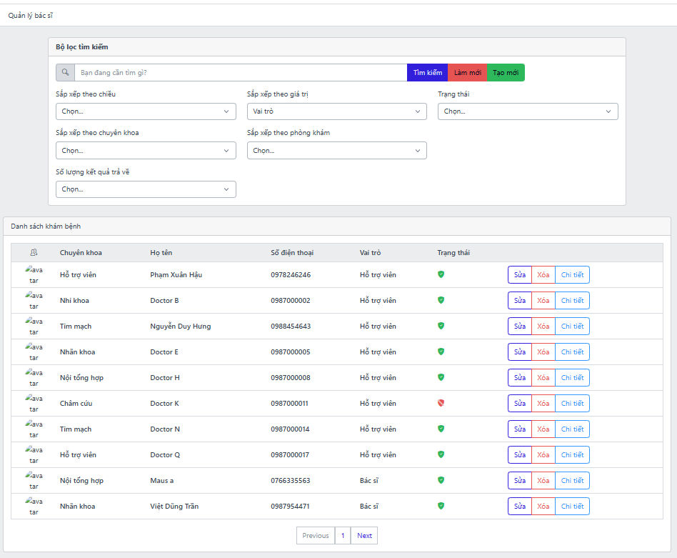

### 10_XemDanhSachBacSi_010

Lọc không chính xác, vẫn hiển thị các bác sĩ vô hiệu hóa.
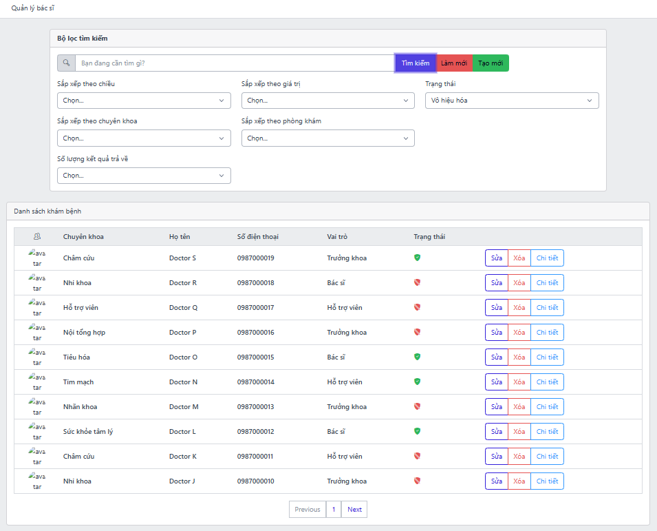

## Thêm, sửa, xóa bác sĩ

- Email:
  - Email mới
  - Email đã tồn tại
  - Email không hợp lệ
- Số điện thoại:
  - Số điện thoại hợp lệ
  - Số điện thoại không hợp lệ
- Tên bác sĩ:
  - Tên bác sĩ hợp lệ
  - Tên bác sĩ không hợp lệ
- Dropdown "Chuyên khoa":
  - Mặc định (để trống)
  - Hỗ trợ viên
  - Nhi khoa
  - Châm cứu
  - Sức khỏe tâm lý
  - Nhãn khoa
  - Tim mạch
  - Tiêu hóa
  - Nội tổng hợp
- Dropdown "Phòng khám":
  - Mặc định (để trống)
  - Phòng 104 Khu A, tầng 1
  - Phòng 102 Khu A, tầng 1
  - Phòng 246 Khu C, Tầng 4
  - Phòng 103 Khu A, tầng 1
- Giá (mức lương):
  - Số nguyên dương
  - Số nguyên âm
  - Số thập phân
- Trạng thái:
  - Mặc định (để trống)
  - Đang hoạt động
  - Vô hiệu hóa
- vai trò:
  - Mặc định (để trống)
  - Bác sĩ
  - Trưởng khoa
  - Hỗ trợ viên

| TC  | Email              | SĐT          | Tên          | Chuyên khoa | Phòng khám              | Giá          | Trạng thái     | Vai trò     |
| --- | ------------------ | ------------ | ------------ | ----------- | ----------------------- | ------------ | -------------- | ----------- |
| 1   | Email đã tồn tại   | Hợp lệ       | Không hợp lệ | Mặc định    | Phòng 246 Khu C, Tầng 4 | Thập phân    | Mặc định       | Bác sĩ      |
| 2   | Email mới          | Không hợp lệ | Không hợp lệ | Nhãn khoa   | Phòng 246 Khu C, Tầng 4 | Nguyên dương | Mặc định       | Mặc định    |
| 3   | Email mới          | Hợp lệ       | Hợp lệ       | Tâm lý      | Phòng 104 Khu A, tầng 1 | Nguyên dương | Mặc định       | Mặc định    |
| 4   | Email không hợp lệ | Hợp lệ       | Hợp lệ       | Nhãn khoa   | Mặc định                | Nguyên âm    | Đang hoạt động | Mặc định    |
| 5   | Email đã tồn tại   | Không hợp lệ | Không hợp lệ | Tâm lý      | Mặc định                | Nguyên âm    | Vô hiệu hóa    | Mặc định    |
| 6   | Email không hợp lệ | Không hợp lệ | Không hợp lệ | Nhãn khoa   | Mặc định                | Nguyên âm    | Vô hiệu hóa    | Trưởng khoa |
| 7   | Email mới          | Không hợp lệ | Hợp lệ       | Mặc định    | Phòng 246 Khu C, Tầng 4 | Nguyên âm    | Vô hiệu hóa    | Bác sĩ      |
| 8   | Email mới          | Không hợp lệ | Hợp lệ       | Nhãn khoa   | Mặc định                | Nguyên âm    | Vô hiệu hóa    | Trưởng khoa |
| 9   | Email không hợp lệ | Không hợp lệ | Hợp lệ       | Tâm lý      | Mặc định                | Thập phân    | Đang hoạt động | Bác sĩ      |
| 10  | Email không hợp lệ | Không hợp lệ | Không hợp lệ | Tâm lý      | Phòng 104 Khu A, tầng 1 | Nguyên âm    | Vô hiệu hóa    | Trưởng khoa |

### 10_ThemSuaXoaBacSi_001

"Issue 1, 16,17, 21, 36, 45
Trên thanh điều hướng có thể truy cập vào trang quản lý bác sĩ không thuộc quyền của Bác sĩ. Tooltip không hiển thị khi để chuột vào, không có nút mặc định.
Không thêm được ảnh đại diện, dùng chung form Sửa và tạo nên Khi tạo vẫn có tiêu đề là Sửa.
Hiển thị lỗi ""This CKEditor 4.20.0 version is not secure. Consider upgrading to the latest one, 4.25.1-lts."" trong trường nhập mô tả."
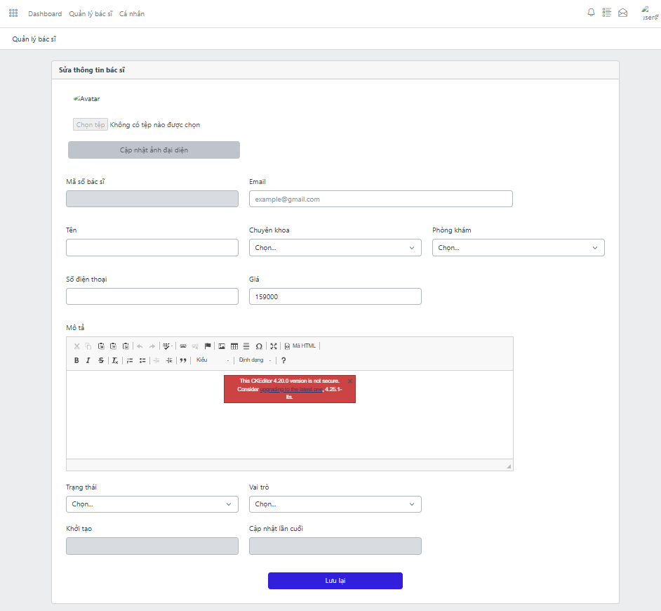

### 10_ThemSuaXoaBacSi_002

Thông báo viết bằng tiếng anh.
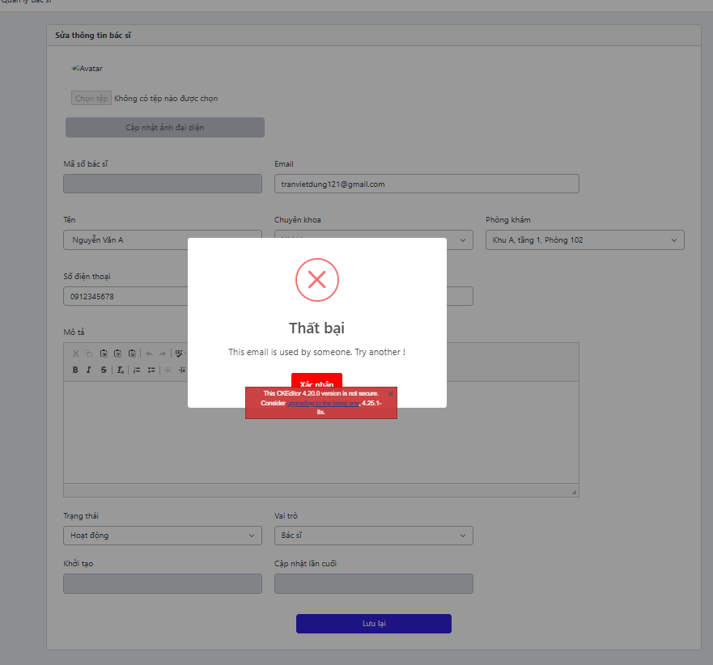

### 10_ThemSuaXoaBacSi_003

Thông báo bằng tiếng anh và không chính xác.
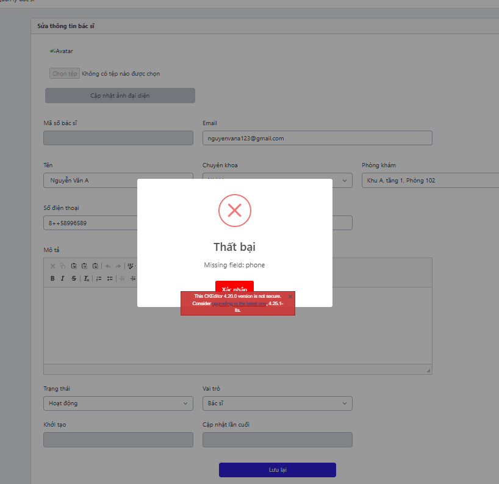

### 10_ThemSuaXoaBacSi_004

Thông báo viết bằng tiếng anh.
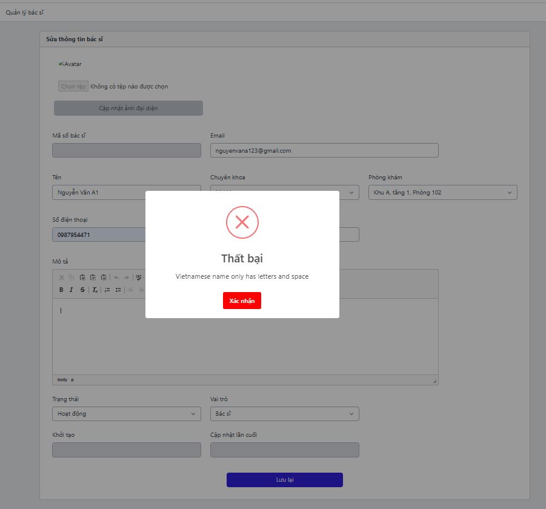

### 10_ThemSuaXoaBacSi_005

Thông báo viết bằng tiếng anh.
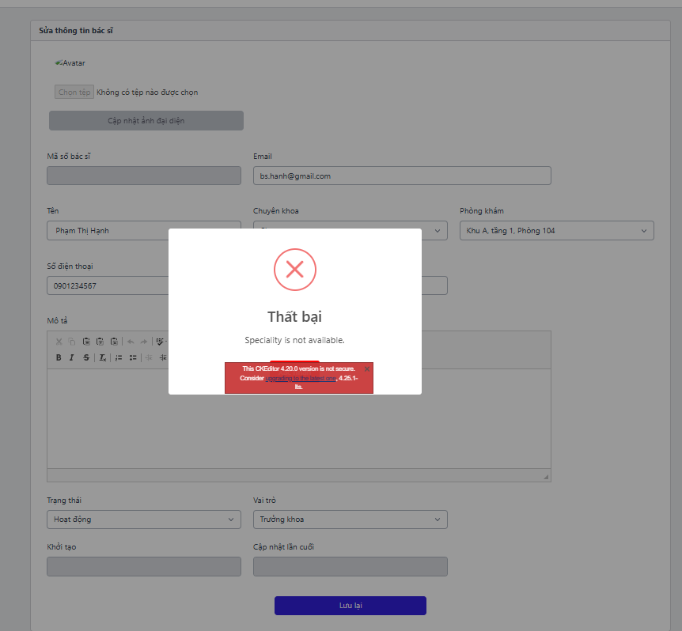

### 10_ThemSuaXoaBacSi_006

Thông báo viết bằng tiếng anh.
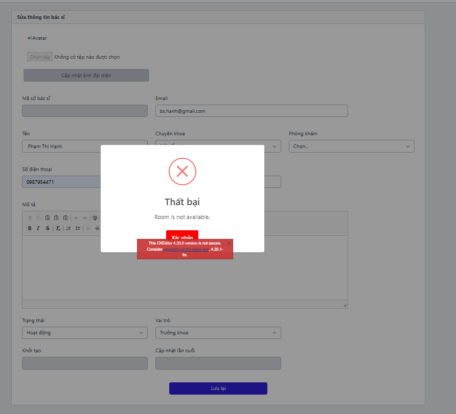

### 10_ThemSuaXoaBacSi_007
Thông báo viết bằng tiếng anh.
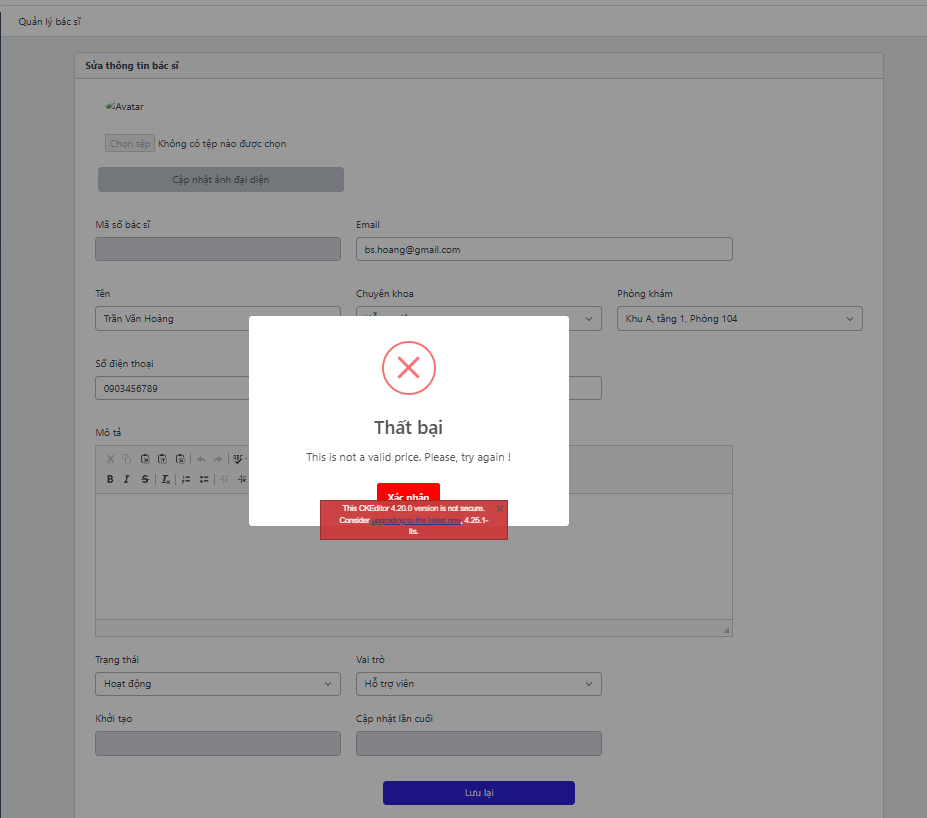

### 10_ThemSuaXoaBacSi_008

Thông báo viết bằng tiếng anh.
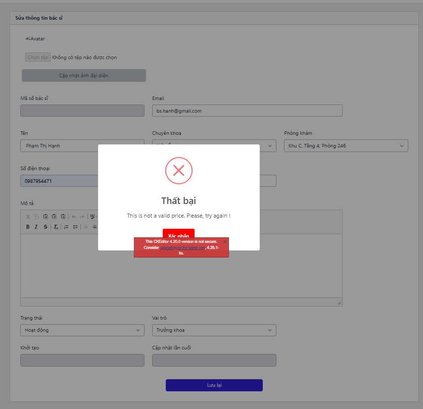

### 10_ThemSuaXoaBacSi_009

Không hiển thị thông báo gì dù thành công.

### 10_ThemSuaXoaBacSi_011

Thông báo không đủ rõ ràng. Nên sửa giao diện thành không xóa được với các bác sĩ đã có liên kết khóa ngoại.
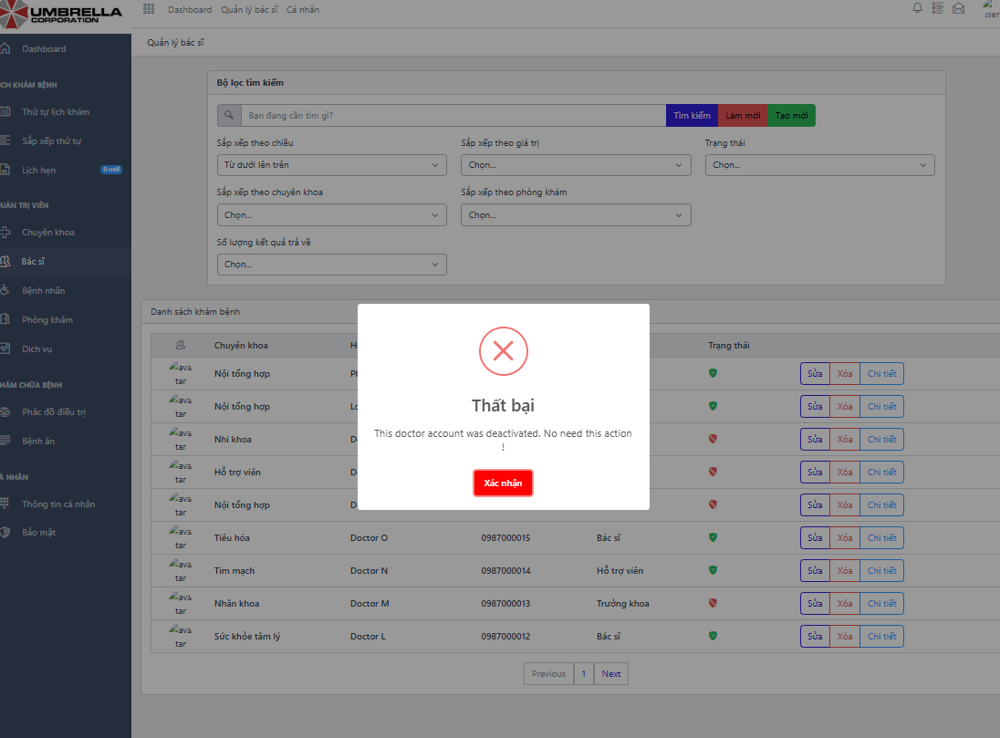