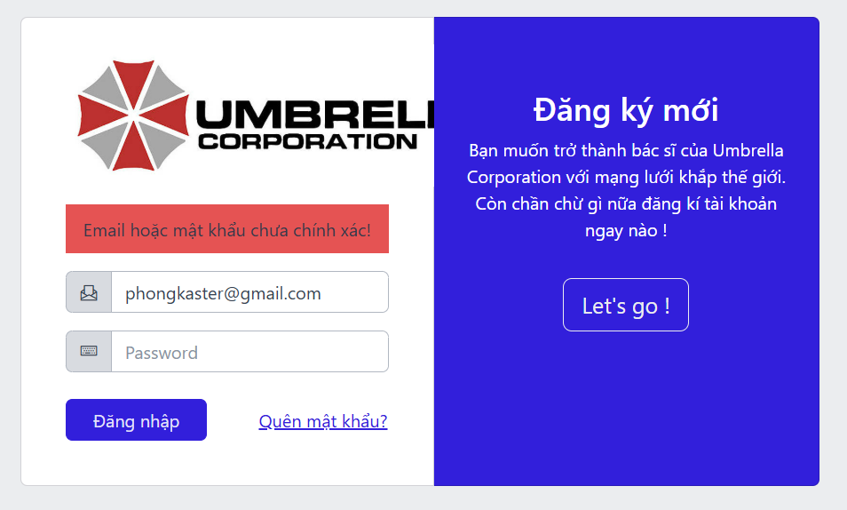

# Module 5

## 5_DangNhap_001

Chi tiết checklist

*1: NA, 2: NA, 3: Pass, 4: NA, 5: NA, 6: Pass, 7: Pass, 8: Pass, 9: NA, 10: NA, 11: Pass, 12: NA, 13: Pass, 14: Pass, 15: NA, 16: NA, 17: NA, 18: Pass, 19: Pass, 20: Pass, 21: Pass, 22: Pass, 23: Fail, 24: Fail, 25: Pass, 26: Pass, 27: NA, 28: NA, 29: NA, 30: NA, 31: Pass, 32: NA, 33: Pass, 34: NA, 35: NA, 36: Pass, 37: Pass, 38: Pass, 39: Pass, 40: NA, 41: Pass, 42: Pass, 43: Pass, 44: NA, 45: Pass, 46: NA, 47: Pass, 48: NA, 49: NA, 50: Pass, 51: NA, 52: NA, 53: Pass, 54: Pass, 55: NA*

 

1. Issue 23 và 24: Thu nhỏ hoặc phóng to màn hình làm mất chữ

## 5_DangNhap_007

1. Thay vì yêu cầu nhập mật khẩu, hệ thống báo mật khẩu không chính xác 