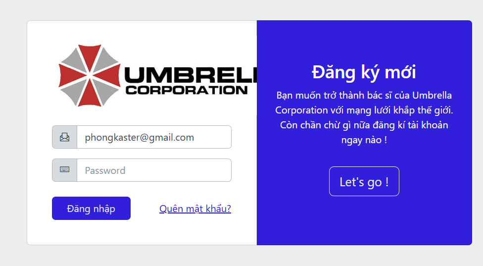

# Module 5

## Đăng Nhập

**Decision table testing**

| Rule | Username                               | Password      |
| ---- | -------------------------------------- | ------------- |
| 1    | Valid                                  | Valid         |
| 2    | Invalid                                | Invalid       |
| 3    | Valid                                  | Invalid       |
| 4    | Invalid                                | Valid         |
| 5    | null                                   | Bất kì        |
| 6    | Bất kì                                 | null          |
| 7    | SQL Injection                          | Bất kì        |
| 8    | Bất kì                                 | SQL Injection |
| 7    | SQL Injection có định dang giống email | Bất kì        |

### 5_DangNhap_001

Chi tiết checklist

*1: NA, 2: NA, 3: Pass, 4: NA, 5: NA, 6: Pass, 7: Pass, 8: Pass, 9: NA, 10: NA, 11: Pass, 12: NA, 13: Pass, 14: Pass, 15: NA, 16: NA, 17: NA, 18: Pass, 19: Pass, 20: Pass, 21: Pass, 22: Pass, 23: Fail, 24: Fail, 25: Pass, 26: Pass, 27: NA, 28: NA, 29: NA, 30: NA, 31: Pass, 32: NA, 33: Pass, 34: NA, 35: NA, 36: Pass, 37: Fail, 38: Pass, 39: Pass, 40: NA, 41: Pass, 42: Pass, 43: Pass, 44: NA, 45: Pass, 46: NA, 47: Pass, 48: NA, 49: NA, 50: Pass, 51: NA, 52: NA, 53: Pass, 54: Pass, 55: NA*

 

1. Issue 23 và 24: Thu nhỏ hoặc phóng to màn hình làm mất chữ
2. Issue 37: Mỗi lần vào trang đăng nhập đều có sẵn tên đăng nhập và mật khẩu mặc định 

### 5_DangNhap_007

1. Thay vì yêu cầu nhập mật khẩu, hệ thống báo mật khẩu không chính xác 

### 5_DangNhap_009

1. Hệ thống có kiểm tra đầy đủ giá trị nhập vào email trường hợp sử dụng một câu lệnh SQL Injection 

### 5_DangNhap_011

1. Hệ thống có kiểm tra đầy đủ giá trị nhập vào email trường hợp sử dụng một câu lệnh SQL Injection có đuôi @ để thỏa mãn kiểm tra kiểu email 

## Đăng Ký

**Equivalence partitioning**

- Email:
  - Hợp lệ: Đúng định dạng email, chưa tồn tại trong hệ thống
  - Không hợp lệ: Sai định dạng email, đã tồn tại trong hệ thống
- Mật khẩu:
  - Hợp lệ: Đủ độ dài, không chứa ký tự đặc biệt
  - Không hợp lệ: Ngắn hơn 6 ký tự
- Họ tên:
  - Hợp lệ: Không chứa ký tự đặc biệt, không chứa số.
  - Không hợp lệ: Chứa ký tự đặc biệt, số.
- Số điện thoại:
  - Hợp lệ: Đúng định dạng số điện thoại, chưa tồn tại trong hệ thống
  - Không hợp lệ: Sai định dạng số điện thoại, đã tồn tại trong hệ thống
- Nhập lại mật khẩu:
  - Hợp lệ: Nhập lại giống mật khẩu đã nhập
  - Không hợp lệ: Nhập lại khác mật khẩu đã nhập

### 5_DangKy_001

Chi tiết checklist

1: Pass, 2: NA, 3: Pass, 4: NA, 5: NA, 6: Pass, 7: Pass, 8: Pass, 9: NA, 10: NA, 11: Pass, 12: NA, 13: Pass, 14: Pass, 15: NA, 16: NA, 17: NA, 18: NA, 19: Pass, 20: Pass, 21: Fail, 22: Pass, 23: Fail, 24: Fail, 25: Pass, 26: Pass, 27: NA, 28: NA, 29: NA, 30: Pass, 31: Pass, 32: NA, 33: Pass, 34: Pass, 35: NA, 36: Pass, 37: Pass, 38: Pass, 39: Pass, 40: NA, 41: Pass, 42: Pass, 43: Fail, 44: NA, 45: Fail, 46: Pass, 47: Pass, 48: NA

 

1. Issue 23 và 24: Textbox bị lệch khi thay đổi kích cỡ cửa sổ 

## Quên mật khẩu

**Equivalence partitioning**

- Email:
  - Hợp lệ: Đúng định dạng email, tồn tại trong hệ thống
  - Không hợp lệ: Sai định dạng email, không tồn tại trong hệ thống
- Mật khẩu:
  - Hợp lệ: Đủ độ dài, không chứa ký tự đặc biệt
  - Không hợp lệ: Ngắn hơn 6 ký tự
- Nhập lại mật khẩu:
  - Hợp lệ: Nhập lại giống mật khẩu đã nhập
  - Không hợp lệ: Nhập lại khác mật khẩu đã nhập
- Mã xác thực:
  - Hợp lệ: Đúng mã đã gửi qua email
  - Không hợp lệ:
    - Bỏ trống
    - Sai mã
    - Hết hạn (Không có trong mô tả)
- Nút "Nhận mã xác thực":
  - Hợp lệ: Gửi mã nếu email đúng định dạng và tồn tại
  - Không hợp lệ: Báo lỗi khi email sai định dạng/không tồn tại
- Nút "Thay đổi mật khẩu":
  - Hợp lệ: Thực hiện thay đổi nếu tất cả thông tin đều hợp lệ
  - Không hợp lệ: Không thực hiện nếu có trường không hợp lệ

### 5_QuenMatKhau_001

Chi tiết checklist

1: Pass, 2: NA, 3: Pass, 4: NA, 5: NA, 6: Pass, 7: Pass, 8: Pass, 9: NA, 10: NA, 11: Pass, 12: NA, 13: Pass, 14: Pass, 15: NA, 16: NA, 17: NA, 18: NA, 19: Pass, 20: Pass, 21: Fail, 22: Pass, 23: Fail, 24: Fail, 25: Pass, 26: Pass, 27: NA, 28: NA, 29: NA, 30: Pass, 31: Pass, 32: NA, 33: Pass, 34: Pass, 35: NA, 36: Pass, 37: Pass, 38: Pass, 39: Pass, 40: NA, 41: Pass, 42: Pass, 43: Fail, 44: NA, 45: Fail, 46: Pass, 47: Pass, 48: NA

 

1. Issue 23 và 24: Textbox bị lệch khi thay đổi kích cỡ cửa sổ 