# Module 6

**Mục lục**
- [Module 6](#module-6)
  - [Xem danh sách khám bệnh trong phác đồ điều trị](#xem-danh-sách-khám-bệnh-trong-phác-đồ-điều-trị)
    - [6\_XemDSKBTrongPhacDoDieuTri\_001](#6_xemdskbtrongphacdodieutri_001)
    - [6\_XemDSKBTrongPhacDoDieuTri\_002](#6_xemdskbtrongphacdodieutri_002)
    - [6\_XemDSKBTrongPhacDoDieuTri\_005](#6_xemdskbtrongphacdodieutri_005)
    - [6\_XemDSKBTrongPhacDoDieuTri\_007](#6_xemdskbtrongphacdodieutri_007)
    - [6\_XemDSKBTrongPhacDoDieuTri\_009](#6_xemdskbtrongphacdodieutri_009)
    - [6\_XemDSKBTrongPhacDoDieuTri\_014](#6_xemdskbtrongphacdodieutri_014)
    - [6\_XemDSKBTrongPhacDoDieuTri\_015](#6_xemdskbtrongphacdodieutri_015)
  - [Xem chi tiết một phác đồ điều trị](#xem-chi-tiết-một-phác-đồ-điều-trị)
    - [6\_XemChiTietPhacDoDieuTri\_001](#6_xemchitietphacdodieutri_001)
    - [6\_XemChiTietPhacDoDieuTri\_002](#6_xemchitietphacdodieutri_002)
    - [6\_XemChiTietPhacDoDieuTri\_003](#6_xemchitietphacdodieutri_003)
    - [6\_XemChiTietPhacDoDieuTri\_004](#6_xemchitietphacdodieutri_004)
  - [Tạo mới, sửa, xóa phác đồ điều trị (Đơn thuốc)](#tạo-mới-sửa-xóa-phác-đồ-điều-trị-đơn-thuốc)
    - [6\_CUDDonThuoc\_001](#6_cuddonthuoc_001)
    - [6\_CUDDonThuoc\_002](#6_cuddonthuoc_002)
    - [6\_CUDDonThuoc\_003](#6_cuddonthuoc_003)
    - [6\_CUDDonThuoc\_004](#6_cuddonthuoc_004)
    - [6\_CUDDonThuoc\_005](#6_cuddonthuoc_005)
    - [6\_CUDDonThuoc\_006](#6_cuddonthuoc_006)
    - [6\_CUDDonThuoc\_007](#6_cuddonthuoc_007)
    - [6\_CUDDonThuoc\_008](#6_cuddonthuoc_008)
    - [6\_CUDDonThuoc\_009](#6_cuddonthuoc_009)
    - [6\_CUDDonThuoc\_011](#6_cuddonthuoc_011)
  - [Xem danh sách khám bệnh trong Quản lý bệnh án](#xem-danh-sách-khám-bệnh-trong-quản-lý-bệnh-án)
    - [6\_XemDanhSachKhamBenhTrongQuanLyBenhAn\_001](#6_xemdanhsachkhambenhtrongquanlybenhan_001)
    - [6\_XemDanhSachKhamBenhTrongQuanLyBenhAn\_002](#6_xemdanhsachkhambenhtrongquanlybenhan_002)
    - [6\_XemDanhSachKhamBenhTrongQuanLyBenhAn\_003](#6_xemdanhsachkhambenhtrongquanlybenhan_003)
    - [6\_XemDanhSachKhamBenhTrongQuanLyBenhAn\_005](#6_xemdanhsachkhambenhtrongquanlybenhan_005)
    - [6\_XemDanhSachKhamBenhTrongQuanLyBenhAn\_006](#6_xemdanhsachkhambenhtrongquanlybenhan_006)
    - [6\_XemDanhSachKhamBenhTrongQuanLyBenhAn\_007](#6_xemdanhsachkhambenhtrongquanlybenhan_007)
    - [6\_XemDanhSachKhamBenhTrongQuanLyBenhAn\_008](#6_xemdanhsachkhambenhtrongquanlybenhan_008)
    - [6\_XemDanhSachKhamBenhTrongQuanLyBenhAn\_009](#6_xemdanhsachkhambenhtrongquanlybenhan_009)
    - [6\_XemDanhSachKhamBenhTrongQuanLyBenhAn\_010](#6_xemdanhsachkhambenhtrongquanlybenhan_010)
    - [6\_XemDanhSachKhamBenhTrongQuanLyBenhAn\_011](#6_xemdanhsachkhambenhtrongquanlybenhan_011)
  - [Tạo, sửa chi tiết một bệnh án](#tạo-sửa-chi-tiết-một-bệnh-án)
    - [6\_TaoSuaBenhAn\_001](#6_taosuabenhan_001)
    - [6\_TaoSuaBenhAn\_003](#6_taosuabenhan_003)
    - [6\_TaoSuaBenhAn\_004](#6_taosuabenhan_004)

## Xem danh sách khám bệnh trong phác đồ điều trị

- Thanh tìm kiếm:
  - Dữ liệu tìm kiếm: Họ tên, Nguyên nhân
  - Gõ từ khóa nằm giữa từ cần tìm kiếm
  - Gõ từ khóa nằm đầu từ cần tìm kiếm
  - Gõ số điện thoại bệnh nhân
  - Gõ các ký tự đặc biệt
- Dropdown chọn "Sắp xếp theo chiều":
  - Mặc định
  - Từ trên xuống dưới
  - Từ dưới lên trên
- Dropdown chọn "Sắp xếp theo":
  - ID
  - Số thứ tự
  - Tên bệnh nhân
  - Thứ tự lượt khám
  - Ngày khám
  - Thời gian tạo
  - Thời gian cập nhật cuối
- Chọn Ngày:
  - Chọn ngày trong tháng hiện tại, quá khứ
  - Chọn ngày trong tháng tương lai
  - Nhập sai định dạng ngày
  - Nhập các giá trị không hợp lệ (ngày lớn hơn 31, tháng lớn hơn 12)

Pairwise Testing

| TC  | Tìm kiếm   | Sắp xếp chiều | Sắp xếp theo     | Ngày          |
| --- | ---------- | ------------- | ---------------- | ------------- |
| 1   | Giữa từ    | Để nguyên     | Để nguyên        | Hôm nay       |
| 2   | Đầu từ     | Để nguyên     | Để nguyên        | Hôm nay       |
| 3   | Số ĐT      | Để nguyên     | Để nguyên        | Hôm nay       |
| 4   | Đặc biệt   | Để nguyên     | Để nguyên        | Hôm nay       |
| 5   | Không nhập | Để nguyên     | Để nguyên        | Hôm nay       |
| 6   | Không nhập | Để nguyên     | Để nguyên        | Rỗng          |
| 7   | Không nhập | Để nguyên     | Để nguyên        | Tương lai     |
| 8   | Không nhập | Để nguyên     | Để nguyên        | Sai định dạng |
| 9   | Không nhập | Mặc định      | ID               | Hôm nay       |
| 10  | Không nhập | Dưới lên      | Số thứ tự        | Hôm nay       |
| 11  | Không nhập | Trên xuống    | Thứ tự lượt khám | Hôm nay       |
| 12  | Không nhập | Mặc định      | Ngày khám        | Hôm nay       |
| 13  | Không nhập | Dưới lên      | Thời gian tạo    | Hôm nay       |
| 14  | Không nhập | Trên xuống    | Cập nhật cuối    | Hôm nay       |

### 6_XemDSKBTrongPhacDoDieuTri_001

Chi tiết checklist

1: Fail, 2: Pass, 3: Pass, 5: Pass, 6: Pass, 7: Pass, 8: Pass, 9: Pass, 10: Pass, 11: NA, 12: NA, 13: Pass, 14: NA, 15: Pass, 16: Fail, 17: Fail, 18: NA, 19: Pass, 20: Pass, 21: Fail, 22: Pass, 23: Pass, 24: Pass, 25: Pass, 26: NA, 27: Pass, 28: NA, 29: NA, 30: NA, 31: Pass, 32: NA, 33: NA, 34: NA, 35: NA, 36: Fail, 37: NA, 38: NA, 39: Pass, 40: Pass, 41: Pass, 42: Pass, 43: NA, 44: Pass, 45: Fail, 46: NA, 47: Pass, 48: Fail

 

### 6_XemDSKBTrongPhacDoDieuTri_002
Issue 1: Không tìm thấy bệnh nhân trong danh sách khám bệnh 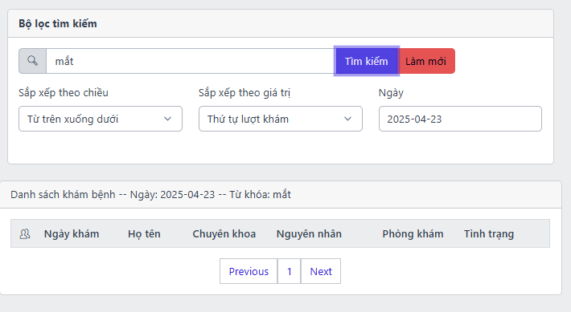

### 6_XemDSKBTrongPhacDoDieuTri_005
Kho báo lỗi mà vẫn tìm kiếm, chỉ là không tìm ra kết quả. 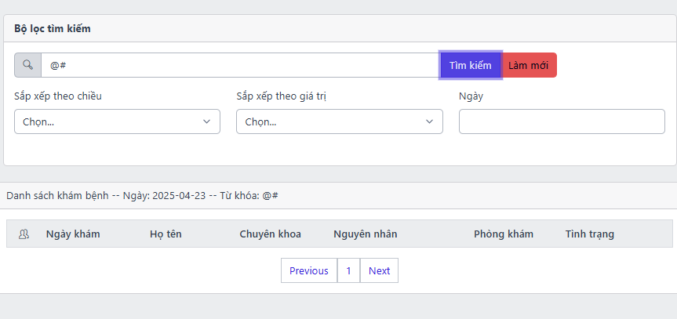

### 6_XemDSKBTrongPhacDoDieuTri_007
Chỉ hiện danh sách hôm nay 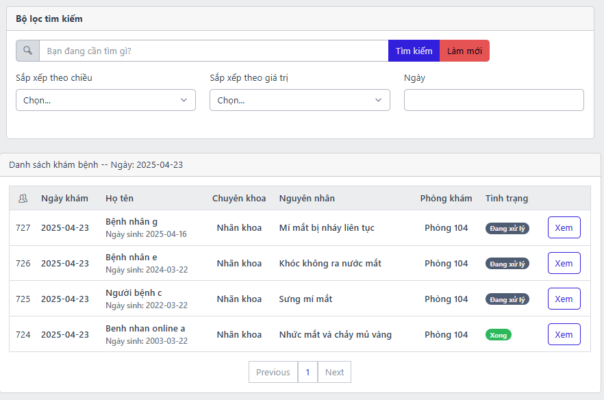

### 6_XemDSKBTrongPhacDoDieuTri_009
Không báo lỗi, chỉ hiển thị ra danh sách trống 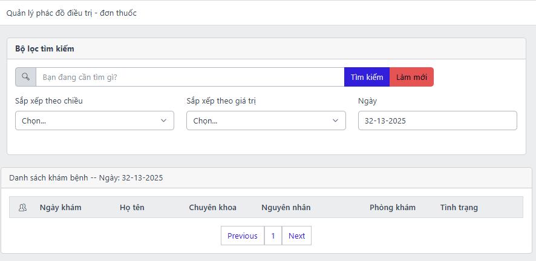

### 6_XemDSKBTrongPhacDoDieuTri_014
Hiển thị lỗi không thực hiện tìm kiếm được.
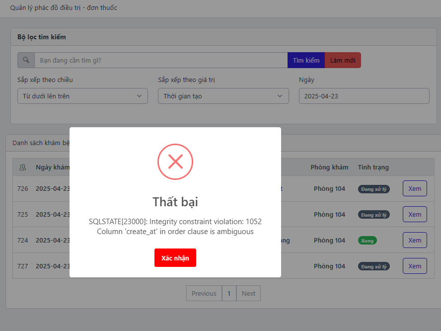

### 6_XemDSKBTrongPhacDoDieuTri_015
Hiển thị lỗi không thực hiện tìm kiếm được.
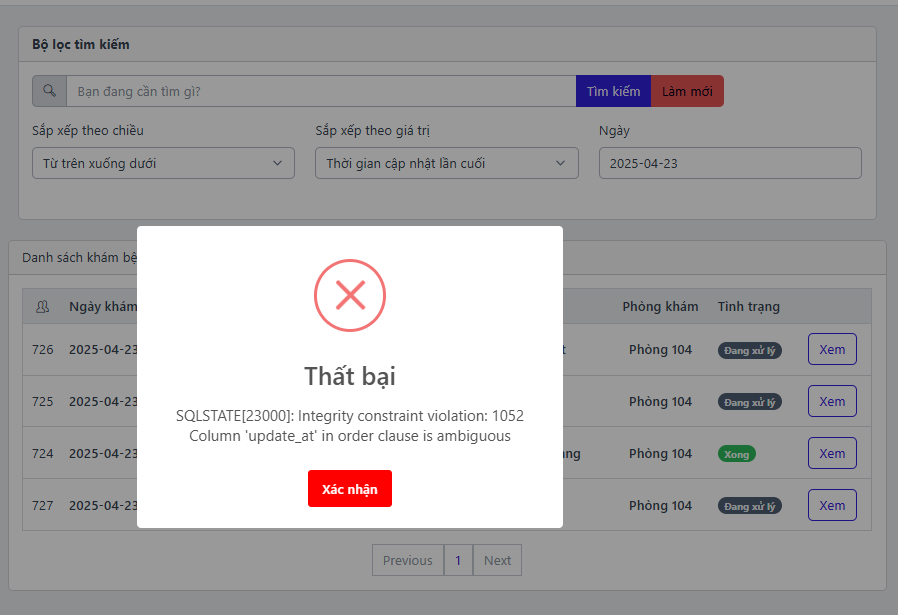

## Xem chi tiết một phác đồ điều trị

### 6_XemChiTietPhacDoDieuTri_001
"Issue 1, 16,17, 21, 36, 45
Trên thanh điều hướng có thể truy cập vào trang quản lý bác sĩ không thuộc quyền của Bác sĩ. Tooltip không hiển thị khi để chuột vào, không có nút mặc định." 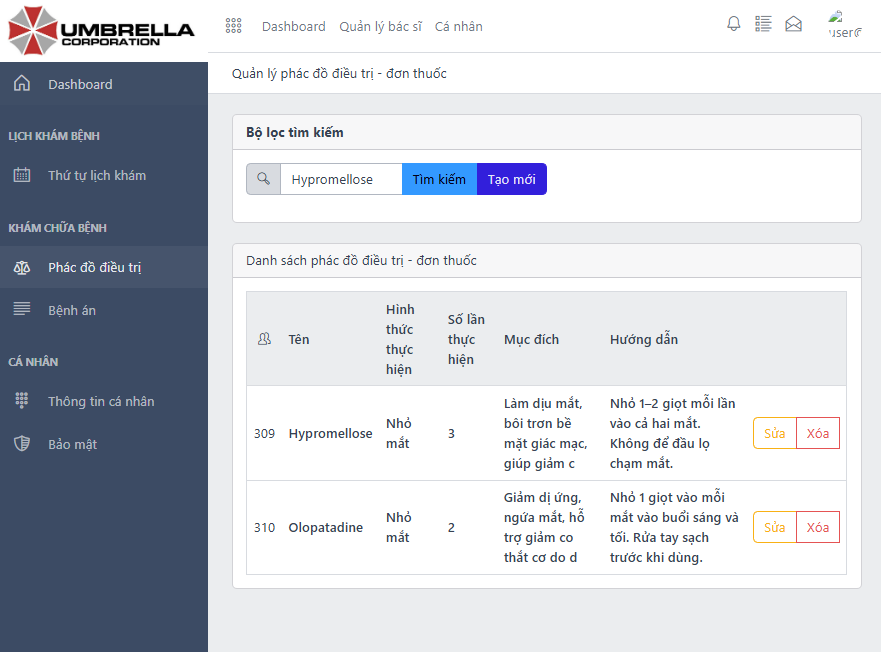

### 6_XemChiTietPhacDoDieuTri_002

Thanh tìm kiếm không hoạt động
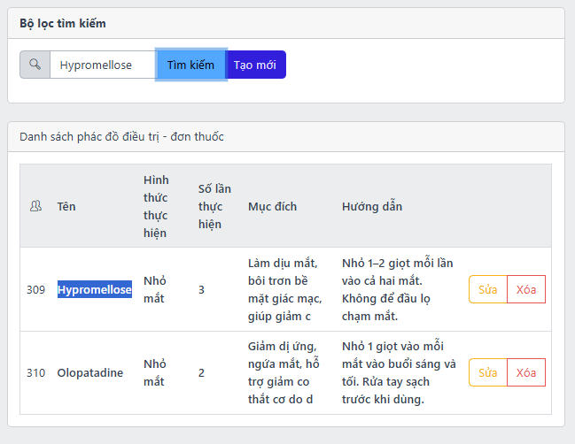

### 6_XemChiTietPhacDoDieuTri_003

Thanh tìm kiếm không hoạt động

### 6_XemChiTietPhacDoDieuTri_004

Thanh tìm kiếm không hoạt động

## Tạo mới, sửa, xóa phác đồ điều trị (Đơn thuốc)

- Tên thuốc:
  - Không chọn tên thuốc
  - Chọn tên thuốc trong danh sách
  - Thuốc đã kê đơn
- Hình thức thực hiện:
  - Uống
  - Tiêm
  - Truyền nước
  - Nhỏ mắt
- Số lần thực hiện:
  - Nhập số nguyên dương
  - Nhập số nguyên âm
  - Nhập số thực
- Lịch uống thuốc:
  - Hàng ngày
  - Một lần
  - Thứ 2 đến Thứ 5
  - Các ngày chẵn
  - Các ngày lẻ
- Thời gian uống thuốc:
  - Thuộc các giá trị thời gian trong dropdown (6:00 AM - 5:00 AM)
  - Nhập giá trị bất kì
- Tác dụng:
  - Nhập các giá trị bất kì
  - Để trống
- Hướng dẫn:
  - Nhập các giá trị bất kì
  - Để trống
  
Pairwise Testing:

| TC  | Tên thuốc            | Hình thức   | Số lần   | Lịch uống       | Thời gian   | Tác dụng   | Hướng dẫn  | Testing Purpose                      |
| --- | -------------------- | ----------- | -------- | --------------- | ----------- | ---------- | ---------- | ------------------------------------ |
| 1   | Không chọn           | Uống        | Số dương | Hàng ngày       | 9:00 AM     | Nhập tùy ý | Nhập tùy ý | Kiểm tra bắt buộc chọn tên thuốc     |
| 2   | Latanoprost          | Tiêm        | Số âm    | Một lần         | Nhập bất kỳ | Nhập tùy ý | Để trống   | Kiểm tra giá trị âm cho số lần       |
| 3   | Hypromellose (đã kê) | Truyền nước | Số dương | Thứ 2 đến Thứ 5 | 9:00 AM     | Nhập tùy ý | Nhập tùy ý | Kiểm tra thuốc đã kê đơn             |
| 3   | Latanoprost          | Truyền nước | Số thực  | Thứ 2 đến Thứ 5 | 9:00 AM     | Nhập tùy ý | Nhập tùy ý | Kiểm tra nhập số lần không hợp lệ    |
| 4   | Natamycin            | Nhỏ mắt     | Số dương | Các ngày chẵn   | Nhập bất kỳ | Nhập tùy ý | Nhập tùy ý | Kiểm tra nhập thời gian không hợp lệ |
| 5   | Acyclovir            | Uống        | Số dương | Các ngày lẻ     | 9:00 AM     | Nhập tùy ý | Để trống   | Kiểm tra Tác dụng để trống           |
| 6   | Ketotifen            | Tiêm        | Số dương | Hàng ngày       | 9:00 AM     | Để trống   | Nhập tùy ý | Kiểm tra hướng dẫn để trống          |

### 6_CUDDonThuoc_001

- Nút ""Xóa"" không hỏi xác nhận trước khi thực thi.
- Lề căn không đều giữa các trường nhập và tiêu đề
- Nút ""Đóng"" có màu trùng với nút bị disable.
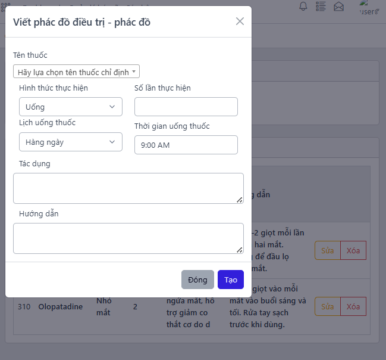

### 6_CUDDonThuoc_002

- Phần chọn tên thuốc không hiển thị đầy đủ các loại thuốc trong DB, mà chỉ lấy 10 thuốc cuối cùng kể cả nhập tên các loại thuốc có trong db.
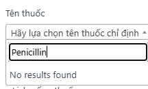

### 6_CUDDonThuoc_003

Có thông báo nhưng bằng tiếng anh và không rõ nghĩa.
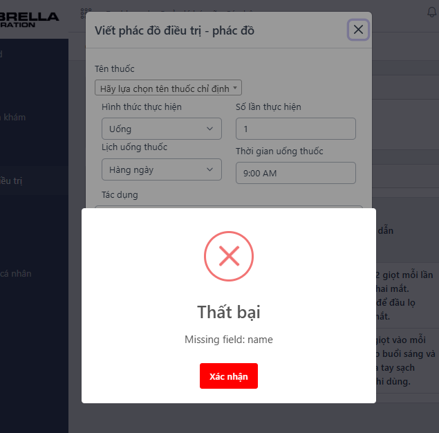

### 6_CUDDonThuoc_004

Có thông báo nhưng bằng tiếng anh và không rõ nghĩa.
Không kiểm tra trường số lần thực hiện.
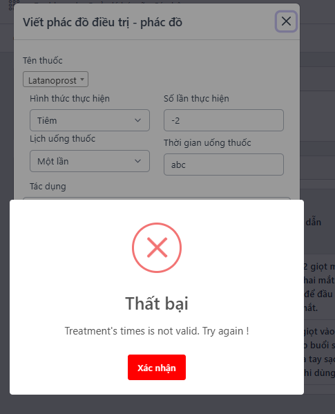

### 6_CUDDonThuoc_005

Thông báo bằng tiếng anh, nhưng sai nội dung.
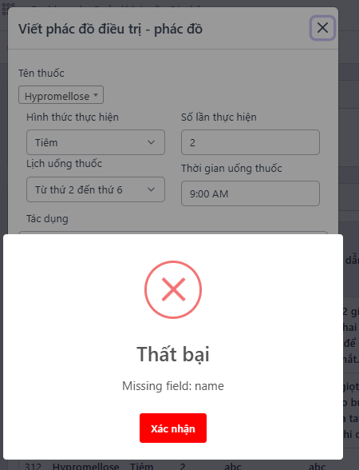

### 6_CUDDonThuoc_006

Có thông báo nhưng bằng tiếng anh và không có hướng dẫn chi tiết định dạng nên sửa là gì.
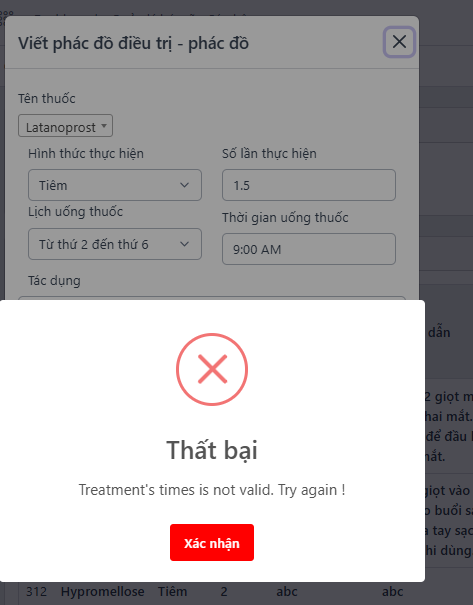

### 6_CUDDonThuoc_007

Không bắt lỗi
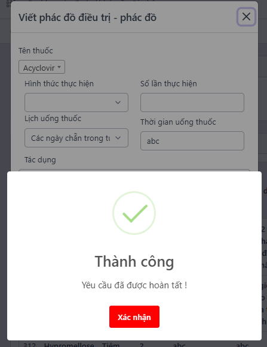

### 6_CUDDonThuoc_008

Trường này được phép để trống, nhưng lại thông báo bắt buôc nhập.
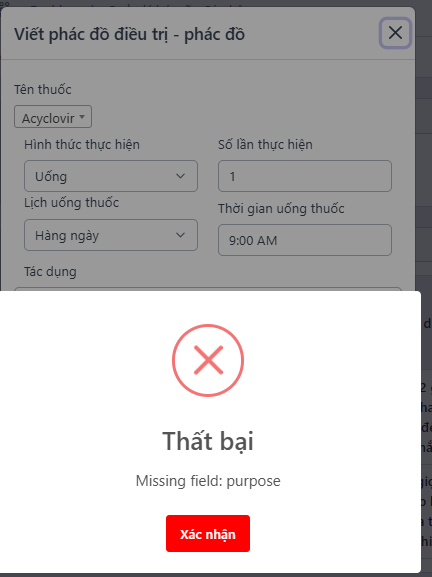

### 6_CUDDonThuoc_009

Thông báo bằng tiếng anh.

### 6_CUDDonThuoc_011

Kết quả khi hiển thị lại bị mất đoạn sau. Do giới hạn bộ nhớ trường này quá ngắn.
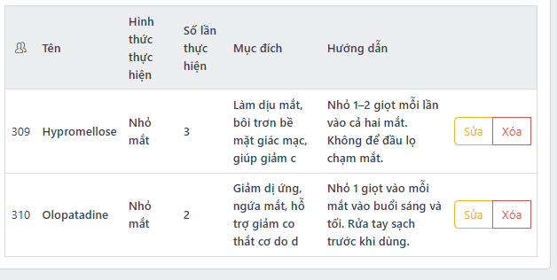

## Xem danh sách khám bệnh trong Quản lý bệnh án

- Thanh tìm kiếm:
  - Dữ liệu tìm kiếm: Họ tên, Nguyên nhân
  - Gõ từ khóa nằm giữa từ cần tìm kiếm
  - Gõ từ khóa nằm đầu từ cần tìm kiếm
- Dropdown chọn "Sắp xếp theo chiều":
  - Mặc định
  - Từ trên xuống dưới
  - Từ dưới lên trên
- Dropdown chọn "Sắp xếp theo":
  - ID
  - Mã chuyên khoa
  - Tên Bác sĩ
  - Thời gian tạo
  - Thời gian cập nhật cuối
- Chọn Ngày:
  - Chọn ngày phù hợp
  - Nhập ngày sai định dạng
- Dropdown chọn "Số lượng kết quả trả về":
  - Mặc định
  - 5, 10, 15, 20, 25, 30.

Pairwise Testing:

| TC  | Vị trí từ | Trường tìm kiếm | Sắp xếp theo chiều | Sắp xếp theo  | Ngày chọn     | Số lượng kết quả | Testing Purpose                 |
| --- | --------- | --------------- | ------------------ | ------------- | ------------- | ---------------- | ------------------------------- |
| 1   | Đầu từ    | Họ tên          | Mặc định           | Mặc định      | Hợp lệ        | Mặc định         | Tìm kiếm bằng họ tên            |
| 2   | Giữa từ   | Nguyên nhân     | Mặc định           | Mặc định      | Hợp lệ        | Mặc định         | Tìm kiếm giữa từ                |
| 3   | Đầu từ    | Nguyên nhân     | Mặc định           | Mặc định      | Hợp lệ        | Mặc định         | Tìm kiếm hợp lệ                 |
| 4   | Để trống  | Nguyên nhân     | Mặc định           | Mặc định      | Sai định dạng | Mặc định         | Tìm kiếm với sai định dạng ngày |
| 5   | Để trống  | Nguyên nhân     | Mặc định           | Thời gian tạo | Hợp lệ        | Mặc định         | ...                             |
| 6   | Để trống  | Nguyên nhân     | ID                 | Tên Bác sĩ    | Hợp lệ        | 5                | ...                             |
| 7   | Để trống  | Nguyên nhân     | Từ trên xuống      | ID            | Hợp lệ        | 10               | ...                             |
| 8   | Để trống  | Nguyên nhân     | Từ dưới lên        | Thời gian tạo | Hợp lệ        | 15               | ...                             |
| 9   | Để trống  | Nguyên nhân     | Mặc định           | Cập nhật cuối | Hợp lệ        | 30               | ...                             |

### 6_XemDanhSachKhamBenhTrongQuanLyBenhAn_001

"Issue 1, 16, 17, 21, 36, 45
Trên thanh điều hướng có thể truy cập vào trang quản lý bác sĩ không thuộc quyền của Bác sĩ. Tooltip không hiển thị khi để chuột vào, không có nút mặc định.
Nút ""Làm mới"" không có tác dụng làm mới thông tin mà chỉ set giá trị tìm kiếm về mặc định và thực hiện tìm kiếm nó.
Cho phép tìm kiếm bằng biểu hiện bệnh trước và sau khi khám nhưng không hiển thị nội dung ra thì rất khó để xem và chọn phù hợp."
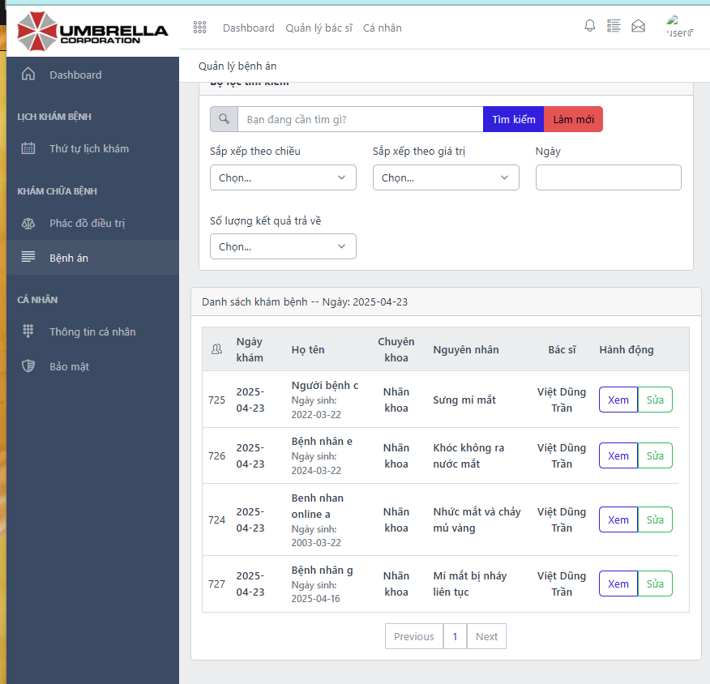

### 6_XemDanhSachKhamBenhTrongQuanLyBenhAn_002

Không tìm kiếm được bằng trường họ tên.
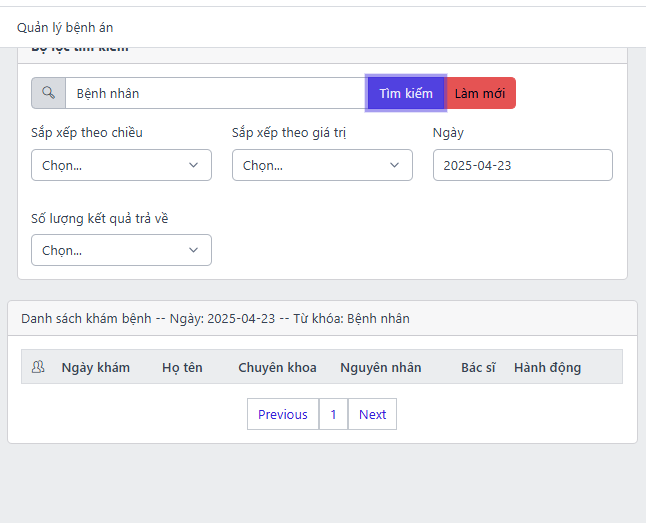

### 6_XemDanhSachKhamBenhTrongQuanLyBenhAn_003

Không tìm kiếm được bằng từ ở giữa từ cần tìm kiếm (Trường nguyên nhân).
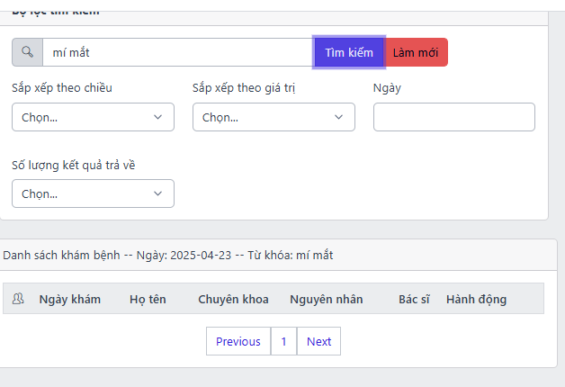

### 6_XemDanhSachKhamBenhTrongQuanLyBenhAn_005

Không kiểm tra dữ liệu định dạng ngày mà chỉ hiển thị danh sách trống.
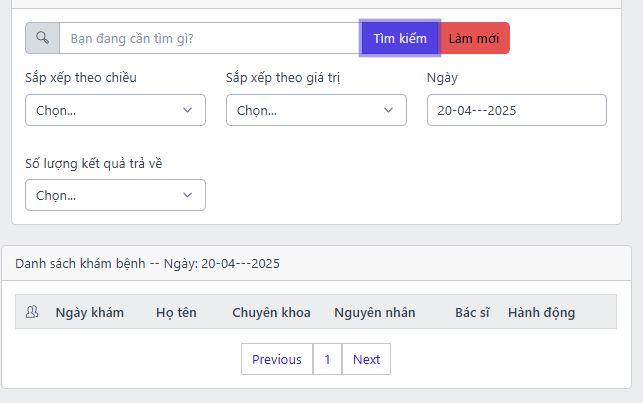

### 6_XemDanhSachKhamBenhTrongQuanLyBenhAn_006

Sau khi chọn thì làm mất luôn dữ liệu trả về chỉ còn 5 mục thay vì hơn 30 mục.
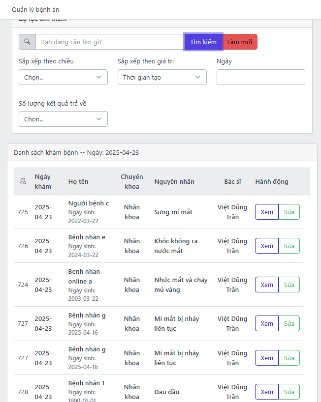

### 6_XemDanhSachKhamBenhTrongQuanLyBenhAn_007

Sau khi chọn thì làm mất luôn dữ liệu trả về chỉ còn 5 mục thay vì hơn 30 mục.
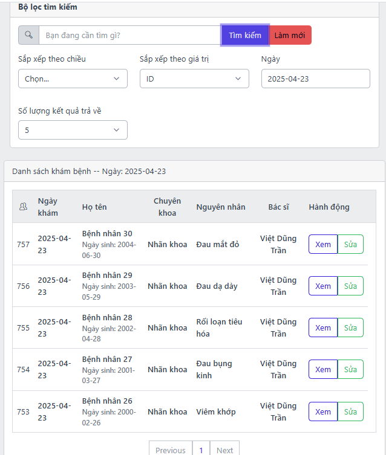

### 6_XemDanhSachKhamBenhTrongQuanLyBenhAn_008

Sau khi chọn thì làm mất luôn dữ liệu trả về chỉ còn 5 mục thay vì hơn 30 mục. Lựa chọn số mục trả về không có tác dụng.
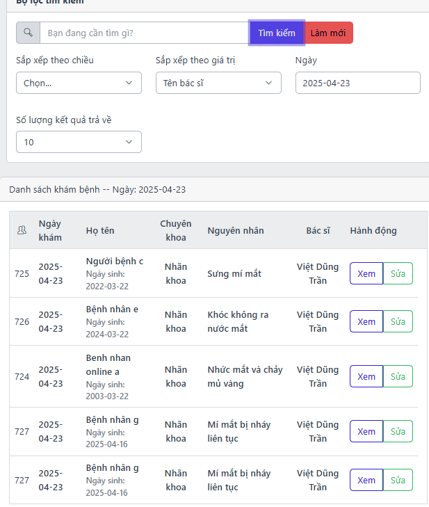

### 6_XemDanhSachKhamBenhTrongQuanLyBenhAn_009

Sau khi chọn thì làm mất luôn dữ liệu trả về chỉ còn 5 mục thay vì hơn 30 mục. Lựa chọn số mục trả về không có tác dụng.
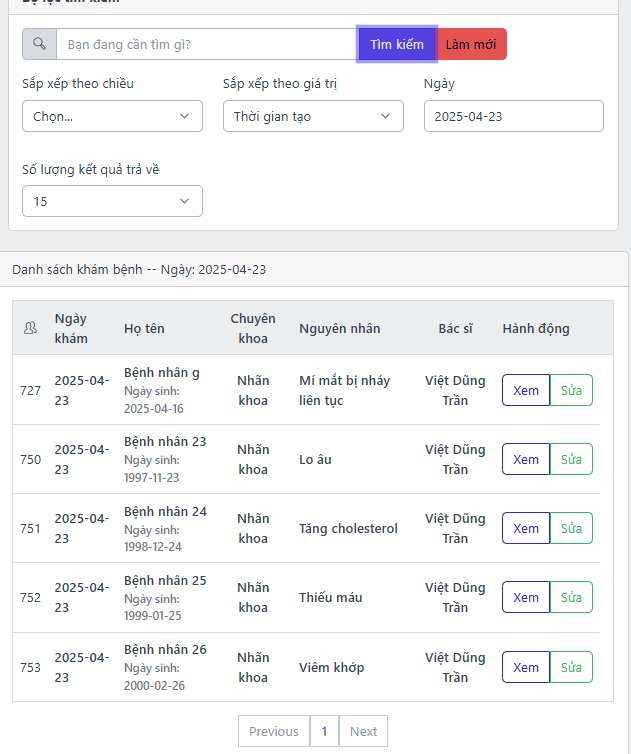

### 6_XemDanhSachKhamBenhTrongQuanLyBenhAn_010

Sau khi chọn thì làm mất luôn dữ liệu trả về chỉ còn 5 mục thay vì hơn 30 mục. Lựa chọn số mục trả về không có tác dụng.
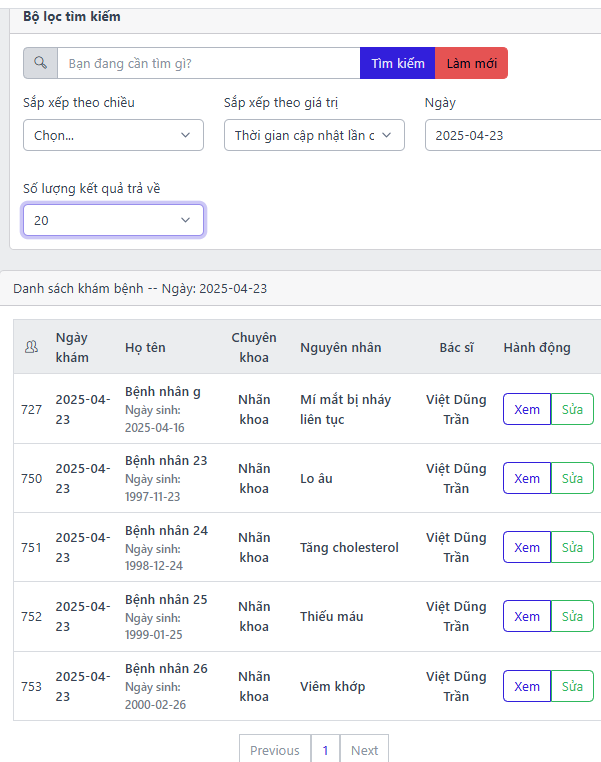

### 6_XemDanhSachKhamBenhTrongQuanLyBenhAn_011

Danh sách bị nháy liên tục
<video controls src="2025-04-23 05-12-08.mp4" title="Title"></video>

https://github.com/user-attachments/assets/cdf80f3e-9b4f-4bdf-99fa-e3ab37eefa8a

## Tạo, sửa chi tiết một bệnh án

- Trạng thái trước khám (Không bắt buộc):
  - Nhập
  - Không nhập
- Trạng thái sau khám (Không bắt buộc):
  - Nhập
  - Không nhập
- Nguyên nhân (Bắt buộc):
  - Nhập
  - Không nhập
- Mô tả (Bắt buộc):
  - Nhập
  - Không nhập

### 6_TaoSuaBenhAn_001

- Issue 1, 16,17, 21, 36, 45
- Trên thanh điều hướng có thể truy cập vào trang quản lý bác sĩ không thuộc quyền của Bác sĩ. Tooltip không hiển thị khi để chuột vào, không có nút mặc định.
- Thông báo ""This CKEditor 4.20.0 version is not secure. Consider upgrading to the latest one, 4.25.1-lts."" Trong giao diện nhập mô tả.
- Các ô nhập để quá bé.
- Nút lưu lại không được để là nút mặc định khi nhấn Enter.
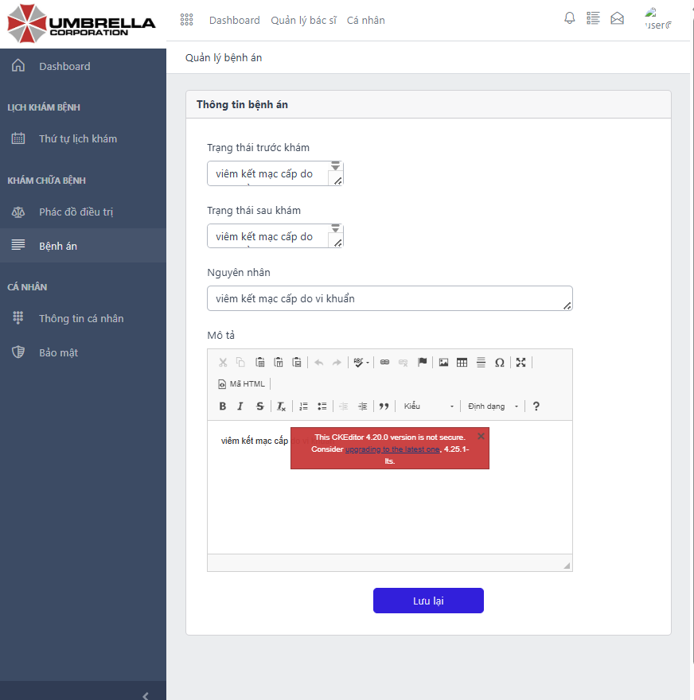

### 6_TaoSuaBenhAn_003

Thông báo bằng tiếng anh.
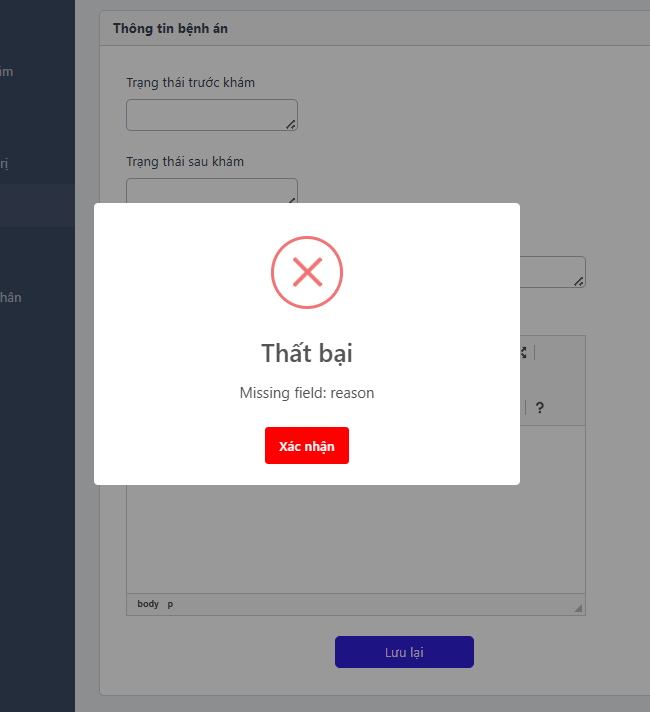

### 6_TaoSuaBenhAn_004

Thông báo bằng tiếng anh.
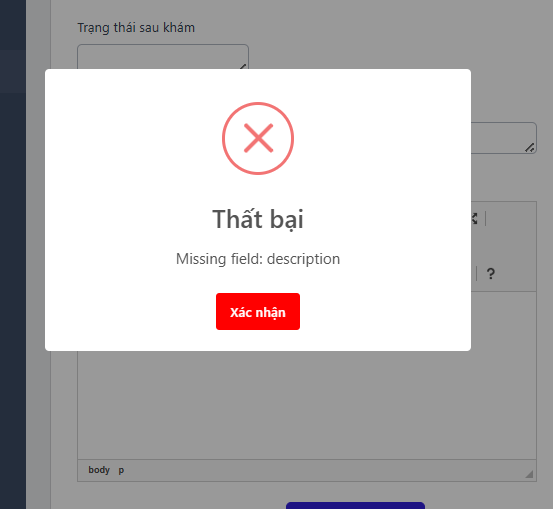
